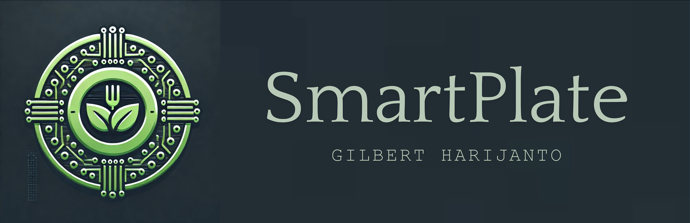

# SmartPlate: AI-Powered Meal Planner

SmartPlate is an AI-driven meal planning application that generates personalized daily meal plans based on the contents of your refrigerator and your dietary preferences.

## Features

- Fridge content analysis via image upload
- Personalized meal plans (breakfast, lunch, dinner)
- Recipe generation with step-by-step instructions
- AI-generated images of meals
- Audio descriptions of recipes
- Customizable user profiles (dietary restrictions, health goals, etc.)
- TDEE (Total Daily Energy Expenditure) calculation
